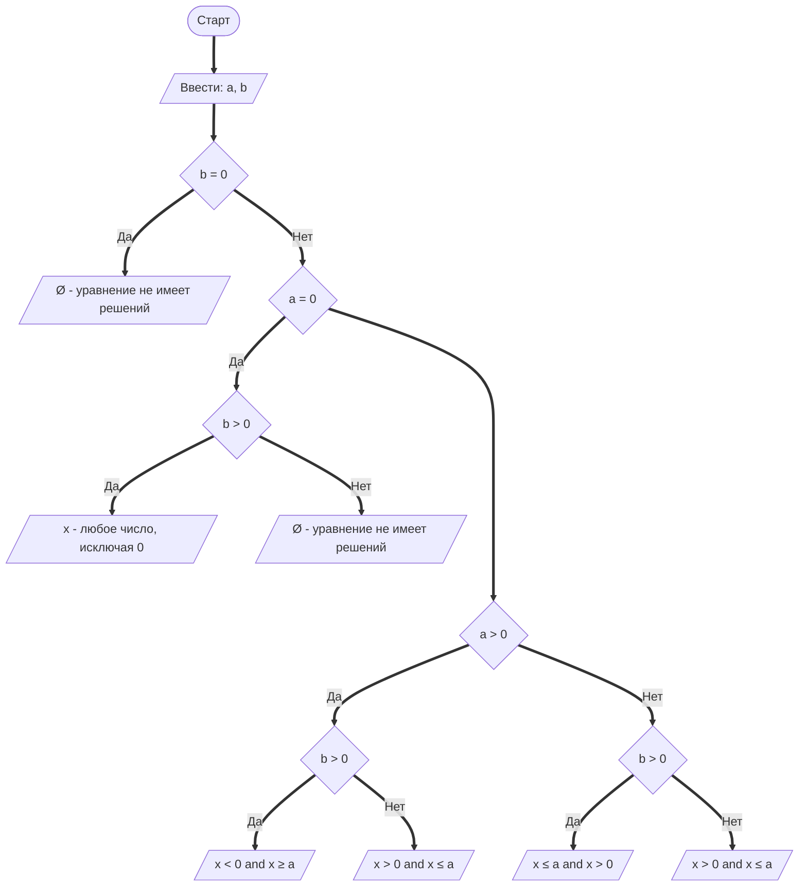

```mermaid
flowchart TD;
  node3([Старт]) ==> B[/Ввести: a, b/]
  B ==> C{b = 0}
  C ==Да==> D[/Ø - уравнение не имеет решений/]
  C ==Нет==> E{a = 0}
  E ==Да==> F{b > 0}
  F ==Да==> H[/x - любое число, исключая 0/]
  F ==Нет==> I[/Ø - уравнение не имеет решений/]
  E ====> G{a > 0}
  G ==Да==> J{b > 0}
  G ==Нет==> K{b > 0}
  J ==Да==> L[/x < 0 and x ≥ a/]
  J ==Нет==> M[/x > 0 and x ≤ a/]
  K ==Да==> N[/x ≤ a and x > 0/]
  K ==Нет==> O[/x > 0 and x ≤ a/]
```
